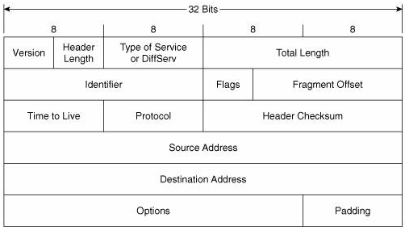

# Packet Capture

pcap 라이브러리를 활용해 네트워크 패킷을 캡쳐하고 정보를 출력하는 프로그램이다.

## Compile and Run

```bash
make
sudo ./packet_capture
```
or 
```bash
gcc main.c -o packet_captue -lpcap
sudo ./packet_captue
```

## 네트워크 패킷

### Ethernet

| 6 Bytes | 6 Bytes | 2 Bytes |
|:-------:|:-------:|:-------:|
|Destination Mac Address|Source Mac Address|Ether Type|
|목적지의 하드웨어 주소|보내는 곳의 하드웨어 주소|패킷 타입|

※ 다른 네트워크 패킷의 경우에는 보내는 곳의 주소가 먼저 나오는 경우가 많지만 특이하게도 Ethernet 은 목적지의 주소가 먼저 나온다.
이는 패킷을 전송할 때 목적지를 사용하기 때문에 조금이라도 빠르게 하기 위함이 아닐까 추측된다.


#### Ether Type

- 0x0800: IPv4
- 0x0806: ARP
- 0x86DD: IPv6 

등 많이 존재한다. 자세한 것은 [EtherType - Wikipedia](https://en.wikipedia.org/wiki/EtherType) 참고

#### Struct

위의 정보를 바탕으로 Ethernet 헤더를 구조체화 하면 다음과 같다.

```c 
struct Ethernet {
    uint8_t destination[6];
    uint8_t source[6];
    uint16_t type;
};
```

### IPv4



#### 각 필드에 대한 설명

- Version: 4
- IHL: ipv4 헤더 길이, 4를 곱하거나 2만큼 왼쪽으로 비트 시프팅 (<< 2) 한다.
- Type of Service: 서비스 품질에 대한 정보, 더 공부 할 필요 있음...
- Total Length: IPv4 패킷의 전체 길이
- Identifier: 식별정보, 더 공부할 필요 있음...
- Flags: 3가지 비트로 구성되며 패킷 단편화와 관련된 비트들이 포함됨
    - 앞의 한 비트는 0으로 고정 (사용하지 않음)
    - 두번째 비트는 0일 경우 라우터에서 단편화가 가능함을 뜻함, 1일 경우 라우터로 하여금 단편화를 하지 말라는 의미.
    - 세번째 비트는 현재의 조각이 마지막이면 0, 뒤에 더 조각이 있으면 1임
- Fragment Offset: 단편화 되기 전 데이터 시작점으로 부터의 차이, 8 바이트 단위로 표시 (실질적인 값은 8을 곱해야 함)
- Time To Live: 패킷이 몇 Hop 를 거칠 수 있는 지를 의미
- Protocol: 이 패킷이 어떤 프로토콜인지를 나타내는 필드, 1은 ICMP, 6은 TCP, 17은 UDP 등
- Header Checksum: 헤더의 오류 검사를 위한 필드 자세한 계산 방법은 [ICMP 소스](../Send%20ICMP/main.c) 참고
- Source: 보내는 컴퓨터의 IPv4 주소 (4바이트)
- Destination: 받는 컴퓨터의 IPv4 주소 (4바이트)
- Options: 자주 사용되지 않음 자세한 것은 아래의 주소 참고

더 자세한 설명은 [IPv4 Wikipedia](https://en.wikipedia.org/wiki/IPv4) 참고


#### Struct

위의 정보를 바탕으로 IPv4 헤더를 필요한 만큼만 구조체화 하면 다음과 같다.

```c
struct IPv4 {
    uint8_t vhl;
    uint8_t type_of_service;
    uint16_t total_length;
    uint16_t identifier;
    uint16_t flags_fragment_offset;
    uint8_t ttl;
    uint8_t protocol;
    uint16_t checksum;
    struct in_addr source;
    struct in_addr destination;
};
```